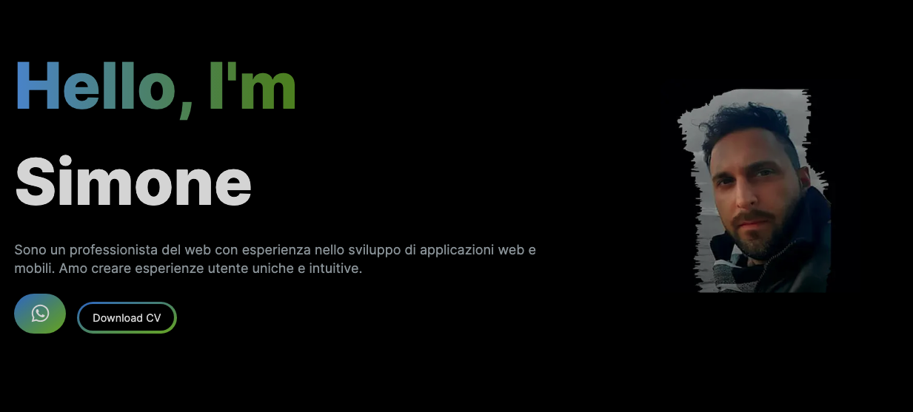

<a name="top"></a>

# Website - My portfolio in NextJs

## Badges


## Demo



---

## Getting Started

## Prerequisites

  ```sh
  Node.js
  npm (Node Package Manager) or yarn
  ```

## Installation

```sh
  git clone https://github.com/Simobara/N_website.git
  cd N_website
  npm install
  npm run dev
```

## Dependencies

```sh
portfolio-website@0.1.0 /Users/0ilbaroneutente/Desktop/progportf
├── @heroicons/react@2.1.5
├── autoprefixer@10.4.15
├── eslint-config-next@13.4.15
├── eslint@8.47.0
├── framer-motion@10.18.0
├── next@14.2.5
├── postcss@8.4.39
├── react-animated-numbers@0.16.0
├── react-countup@6.5.3
├── react-dom@18.2.0
├── react-icons@5.2.1
├── react-type-animation@3.2.0
├── react@18.2.0
├── resend@1.1.0
└── tailwindcss@3.3.3
```

## License

This project is licensed under the MIT License.
See the LICENSE file for more details.

## Link

-  - [click here](https://www.linkedin.com/in/siba2410)
-  - [click here](https://github.com/Simobara)
-  - [click here](https://www.youtube.com/watch?v=dQw4w9WgXcQ)

##

[⤴️ top](#top)
